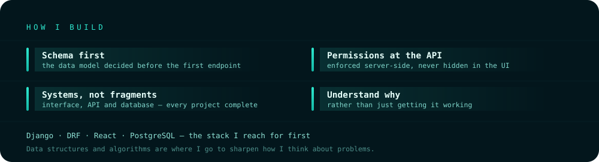

  

 

  <h3>I build complete, production-shaped web applications.</h3>
  

    <i>The interface, the API behind it, and the database underneath.</i>
  

---

##  &nbsp;Engineer

Full-stack software engineer working across **Django**, **Django REST Framework**, **React**, and **PostgreSQL**.

What interests me is the whole system: how a request travels from the browser through the API into the
database and back, how authentication holds it together, and how the schema shapes what is possible.

Python came first, then data structures and algorithms — still where I go to sharpen how I think about
problems. Django came next and stayed, because it let me build entire applications rather than fragments.
From there: DRF for APIs, databases in earnest with MySQL, SQLite and PostgreSQL, and React on the frontend.

<table>
<tr>
<td width="33%" valign="top">

**Focus**

Backend architecture, REST API design, and relational schema modelling.

</td>
<td width="33%" valign="top">

**Approach**

Role-based access control, JWT authentication, decoupled frontends.

</td>
<td width="33%" valign="top">

**Available**

Remote · Hybrid · Onsite

`jahidhr05@gmail.com`

</td>
</tr>
</table>

---

##  &nbsp;Architecture

  

---

##  &nbsp;Stack

<table>
<tr>
<td valign="top" width="33%">

**CORE**

</td>
<td valign="top" width="33%">

**PRODUCTION**

</td>
<td valign="top" width="33%">

**EXPANDING**

</td>
</tr>
</table>

<b>&nbsp;Full capability matrix</b>

 

| Area | Core | Strong | Working | Familiar |
|:--|:--|:--|:--|:--|
| **Languages** | Python | SQL, HTML, CSS | JavaScript | Java |
| **Backend** | Django, DRF, Django ORM | REST API design, Auth (JWT / session / OAuth) | — | FastAPI, Node.js |
| **Frontend** | — | React, React Router, Fetch API | Tailwind, Context API, Vite, Bootstrap | Next.js |
| **Databases** | — | MySQL, PostgreSQL, SQLite, Schema design | Query optimisation | — |
| **DevOps** | — | Git, GitHub, Environment management | Linux, Vercel/Netlify, Railway/Render | Nginx, GitHub Actions, AWS |
| **Tools** | — | VS Code, Postman, Git CLI, AI coding tools | pgAdmin, MySQL Workbench | Figma |

**Foundations** — Data Structures · Algorithms · Database Management Systems · Operating Systems · Computer Networks · Object-Oriented Programming · Software Engineering

---

##  &nbsp;Selected Work

<table>
<tr>
<td width="50%" valign="top">

### [MicroMart ↗](https://github.com/jhraihan/MicroMart)

`E-COMMERCE`

Multi-role platform serving customers, sellers and administrators — product discovery, cart and checkout, **SSLCommerz** payment processing, order tracking, and seller inventory management.

</td>
<td width="50%" valign="top">

### [IntelliChat ↗](https://github.com/jhraihan/llm_powered_ai_chatbot)

`AI · STREAMING`

Chat built on the **Google Gemini API**, streaming responses token by token over **Server-Sent Events**. Conversations persist in PostgreSQL, so a session outlives the page reload.

</td>
</tr>
<tr>
<td width="50%" valign="top">

### [MediDesk ↗](https://github.com/jhraihan/hospital-management-system-django-react)

`HEALTHCARE`

Hospital management across **four distinct permission tiers** — appointments, records and staff workflows. The kind of access matrix that has to be right in the schema before it can be right in the interface.

</td>
<td width="50%" valign="top">

### [EduFlow ↗](https://github.com/jhraihan/Learning-Management-System-django-react)

`EDTECH`

Learning management system with courses, enrolment and content delivery separated cleanly across instructor and student roles, with permissions enforced at the API layer.

</td>
</tr>
<tr>
<td colspan="2" valign="top">

### [PromptCanvas ↗](https://github.com/jhraihan/tech-store-platform-django-react)

`AI · GENERATIVE`

Text-to-image generation through the **Hugging Face inference API**, with authentication and generated images persisted for later retrieval.

</td>
</tr>
</table>

   
  

---

##  &nbsp;Principles

  

---

   
  <h3>Open to remote, hybrid and onsite roles.</h3>
  
Backend, full-stack, and API engineering.

   

   
  <code>Dhaka, Bangladesh</code>

