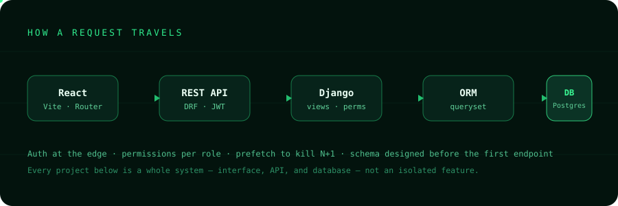
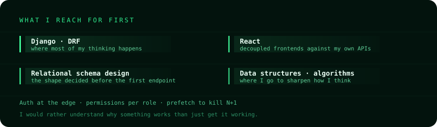

<div align="center">
  
</div>

<div align="center">

[](https://portfolio-web-asu3.onrender.com/)
[](https://www.linkedin.com/in/md-jahid-hasan-raihan-745023393)
[](https://leetcode.com/u/Jahid_Hasan_Raihan/)
[](mailto:jahidhr05@gmail.com)

</div>

---

```console
$ cat about.md
```

> I build full-stack web applications with **Django** and **React**. What interests me is the
> whole system: how a request travels from the browser through the API into the database and
> back, how authentication holds it together, and how the schema shapes what is possible.

Final-year **BSc in Computer Science and Engineering** at Independent University, Bangladesh
(expected December 2026). Python came first, then data structures and algorithms — still where
I go to sharpen how I think about problems. Django came next and stayed, because it let me build
entire applications rather than fragments.

I would rather understand *why* something works than just get it working.

<table>
<tr>
<td width="50%" valign="top">

**Currently**
- Finishing my BSc — final year
- Building full-stack projects end to end
- Sharpening DSA on LeetCode

</td>
<td width="50%" valign="top">

**Open to**
- Remote · Hybrid · Onsite roles
- Backend, full-stack, and API work
- `jahidhr05@gmail.com`

</td>
</tr>
</table>

---

<div align="center">
  
</div>

---

## Tech Stack

<table>
<tr>
<td valign="top" width="33%">

### Core


</td>
<td valign="top" width="33%">

### Working with


</td>
<td valign="top" width="33%">

### Exploring


</td>
</tr>
</table>

<details>
<summary><b>Full breakdown</b> — every tool, by depth</summary>

<br>

| Area | Core | Strong | Working | Familiar |
|:--|:--|:--|:--|:--|
| **Languages** | Python | SQL, HTML, CSS | JavaScript | Java |
| **Backend** | Django, DRF, Django ORM | REST API design, Auth (JWT / session / OAuth) | — | FastAPI, Node.js |
| **Frontend** | — | React, React Router, Fetch API | Tailwind, Context API, Vite, Bootstrap | Next.js |
| **Databases** | — | MySQL, PostgreSQL, SQLite, Schema design | Query optimisation | — |
| **DevOps** | — | Git, GitHub, Env management | Linux, Vercel/Netlify, Railway/Render | Nginx, GitHub Actions, AWS |
| **Tools** | — | VS Code, Postman, Git CLI, AI coding tools | pgAdmin, MySQL Workbench | Figma |

**Coursework** — Data Structures · Algorithms · DBMS · Operating Systems · Computer Networks · OOP · Software Engineering

</details>

---

## Selected Work

Five complete applications. Each one ships a real frontend, a real API, and a designed schema.

<table>
<tr>
<td width="50%" valign="top">

### 🛒 [MicroMart](https://github.com/jhraihan/MicroMart)
**Multi-role e-commerce with live payments**

Three distinct user types — customers, sellers, admins — with product discovery, cart and checkout, **SSLCommerz** payment processing, order tracking, and seller inventory management.

`Django` `DRF` `React` `PostgreSQL` `SSLCommerz`

</td>
<td width="50%" valign="top">

### 🎓 [EduFlow](https://github.com/jhraihan/Learning-Management-System-django-react)
**Role-based learning management system**

Courses, enrolment, and content delivery separated cleanly across instructor and student roles, with permissions enforced at the API layer rather than hidden in the UI.

`Django` `DRF` `React` `PostgreSQL` `JWT`

</td>
</tr>
<tr>
<td width="50%" valign="top">

### 💬 [IntelliChat](https://github.com/jhraihan/llm_powered_ai_chatbot)
**Streaming AI chat that survives a reload**

Built on the **Google Gemini API**, streaming responses token by token over **Server-Sent Events**. Conversations persist in PostgreSQL, so a session outlives the page. Markdown rendering with syntax-highlighted code.

`Django` `SSE` `Gemini API` `React` `PostgreSQL`

</td>
<td width="50%" valign="top">

### 🏥 [MediDesk](https://github.com/jhraihan/hospital-management-system-django-react)
**Hospital system, four-role access control**

Appointments, records, and staff workflows across four separate permission tiers — the kind of access matrix that has to be right in the schema before it can be right in the interface.

`Django` `DRF` `React` `MySQL`

</td>
</tr>
<tr>
<td colspan="2" valign="top">

### 🎨 [PromptCanvas](https://github.com/jhraihan/tech-store-platform-django-react)
**Text-to-image generation with stored results**

Turns text prompts into generated images through the **Hugging Face inference API**, with authentication and generated images persisted for later retrieval.

`Django` `Hugging Face API` `React` `PostgreSQL`

</td>
</tr>
</table>

<div align="center">
  <br>
  <a href="https://portfolio-web-asu3.onrender.com/">
    
  </a>
</div>

---

## How I Work

<div align="center">
  
</div>

---

<div align="center">

```console
$ ./contact --available
```

**Open to remote, hybrid, and onsite roles.**

[](mailto:jahidhr05@gmail.com)
[](https://portfolio-web-asu3.onrender.com/)
[](https://www.linkedin.com/in/md-jahid-hasan-raihan-745023393)

<sub>Dhaka, Bangladesh · <code>~/jhraihan</code></sub>

</div>
